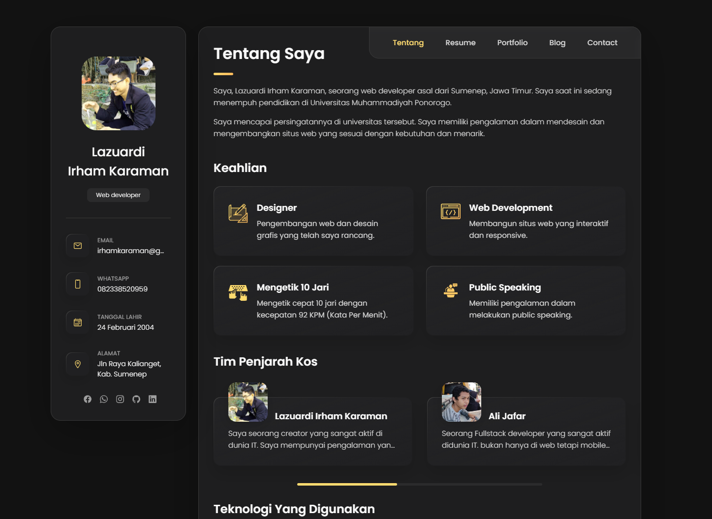

```markdown
# Portfolio Lazuardi Irham Karaman

This repository contains the source code for my personal portfolio website built with Laravel. This project showcases my CV and various projects I've worked on, providing an improved version of my previous CV. The website is hosted at [irhamkaraman.my.id](https://irhamkaraman.my.id/).



This website marks the culmination of my web programming practical course, demonstrating the skills and knowledge I have acquired throughout the course.

## Features
- Responsive design
- Dynamic contact form
- Portfolio project management
- Secure and efficient data handling with Laravel

## Installation and Setup
Follow these steps to set up the project locally:

### Prerequisites
- PHP 7.3 or higher
- Composer
- Node.js & npm
- MySQL

### Clone the Repository
```bash
git clone https://github.com/irhamkaraman/portfolio-irham-baru.git
cd portfolio-irham-baru
```

### Install Dependencies
```bash
composer install
npm install
```

### Set Up Environment Variables
Copy the `.env.example` to `.env` and update the necessary environment variables, especially the database configuration.
```bash
cp .env.example .env
```

### Generate Application Key
```bash
php artisan key:generate
```

### Run Database Migrations
```bash
php artisan migrate
```

### Seed the Database (Optional)
```bash
php artisan db:seed
```

### Serve the Application
```bash
php artisan serve
```

Visit `http://localhost:8000` in your web browser to see the application.

## Deployment
For deployment, ensure that you have set up the correct environment variables and have run the necessary database migrations. Use a web server like Apache or Nginx to serve the Laravel application. Here is a simple guide for deploying Laravel applications:

1. **Clone the Repository on the Server:**
   ```bash
   git clone https://github.com/irhamkaraman/portfolio-irham-baru.git
   cd portfolio-irham-baru
   ```

2. **Install Dependencies:**
   ```bash
   composer install --optimize-autoloader --no-dev
   npm install --production
   npm run production
   ```

3. **Set Up Environment Variables:**
   Copy the `.env.example` to `.env` and update the necessary environment variables for the production environment.

4. **Generate Application Key:**
   ```bash
   php artisan key:generate
   ```

5. **Run Database Migrations:**
   ```bash
   php artisan migrate --force
   ```

6. **Set File Permissions:**
   Ensure that the `storage` and `bootstrap/cache` directories are writable by the web server.

7. **Set Up a Web Server:**
   Configure Apache or Nginx to serve the application, pointing the web root to the `public` directory.

## Conclusion
This project represents the final practical exercise in my web programming course. It not only serves as a comprehensive portfolio showcasing my skills and projects but also demonstrates my ability to build a full-fledged web application using Laravel.

For any questions or suggestions, please feel free to contact me or raise an issue on this repository.

Happy Coding!
```

Ensure the image file `image.png` is located in the root directory of your project repository to be correctly displayed in the README.
